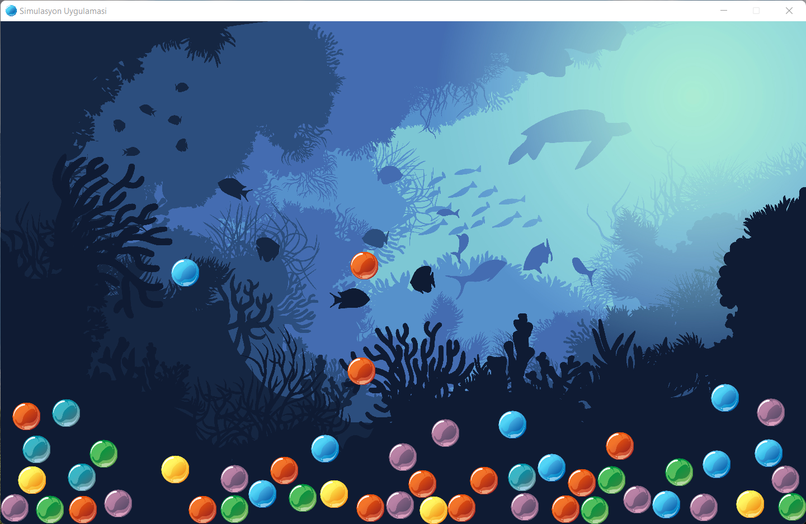

# Ball-Simulation
Ball Simulation App

https://libgdx.com/wiki/

Bu kaynakta LibGDX kütüphanesi kullanılarak nesneler üzerinde ki yer çekimi ve nesneler arasıda çarpma (collision) deneyimleri simüle edilmiştir.

Siirt Üniversitesi, Simülasyon ve Modelleme dersi için hazırlanmıştır. 

Ekran Görüntüsü:

